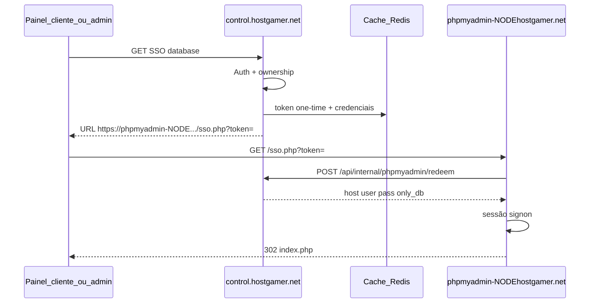

# phpMyAdmin SSO (por node)

Cada node de games com MariaDB local tem o **próprio** phpMyAdmin, acessível só via link SSO do painel (`control.hostgamer.net`). Login direto no phpMyAdmin redireciona para `https://hostgamer.net`.

Arquivos do bridge: [`docker/hostgamer-phpmyadmin/`](../docker/hostgamer-phpmyadmin/).

## Arquitetura



| Quem | Login MySQL | Restrição |
|------|-------------|-----------|
| Cliente | user/senha do `Database` | `only_db` = aquele DB |
| Admin | user/senha do `DatabaseHost` | `only_db` = todos os DBs do servidor |

Hostname público: `https://phpmyadmin-{node}.hostgamer.net`  
Ex.: node `node050.hostgamer.net` → `https://phpmyadmin-node050.hostgamer.net`

> **SSL Cloudflare:** use `phpmyadmin-NODE` (um label). `phpmyadmin.node050.hostgamer.net` fica fora do Universal SSL (`*.hostgamer.net`) e causa `ERR_SSL_VERSION_OR_CIPHER_MISMATCH`.

## Pré-requisitos no painel

1. `.env`:

```env
PHPMYADMIN_SSO_ENABLED=true
PHPMYADMIN_URL_TEMPLATE=https://phpmyadmin-{node}.hostgamer.net
PHPMYADMIN_SSO_SECRET=<mesmo secret do bridge, min 32 hex chars>
PHPMYADMIN_SSO_TOKEN_TTL=60
```

Gerar secret:

```bash
php -r "echo bin2hex(random_bytes(32)), PHP_EOL;"
```

2. `php artisan config:clear` (ou `config:cache`).

3. `database_hosts.node_id` apontando para o node correto (o SSO resolve `{node}` pelo `nodes.fqdn`).

### Endpoints do painel

| Rota | Uso |
|------|-----|
| `GET /api/client/servers/{server}/databases/{database}/phpmyadmin` | Cliente (perm. `database.read`) → JSON `{ attributes.url }` |
| `GET /admin/servers/view/{server}/database/phpmyadmin` | Admin → 302 para SSO |
| `POST /api/internal/phpmyadmin/redeem` | Bridge (Bearer = `PHPMYADMIN_SSO_SECRET`), sem sessão Sanctum |

Código principal:

- `app/Services/Databases/PhpMyAdminSsoService.php`
- `app/Http/Controllers/Api/Internal/PhpMyAdminSsoController.php`
- `config/phpmyadmin.php`
- UI: `resources/scripts/components/server/databases/DatabaseRow.tsx`
- Admin: `resources/views/admin/servers/view/database.blade.php`

## Deploy do phpMyAdmin em um node (checklist)

Valores de exemplo para **node050** (`10.8.0.6` / `89.39.161.172`). Troque `NODE`, IPs e hostnames.

### 1. MariaDB no node

- Container (ou serviço) escutando em IP do node (ex. WireGuard `10.8.0.X:3306`).
- Host no painel: `Database Host` com `host` = FQDN/IP do MariaDB e **`node_id`** = esse node.

### 2. Gcore ACL (saída cloudflared)

Antes do `DROP` final, no perfil do IP público do node:

| policy | proto | sport | dport |
|--------|-------|-------|-------|
| `ratelimiter-low` | udp | 7844 | — |
| `ratelimiter-low` | tcp | 7844 | — |

(Mesmo padrão de “saída” que 80/443: filtro por **sport** nas respostas.)

### 3. cloudflared (systemd, boot)

```bash
sudo mkdir -p --mode=0755 /usr/share/keyrings
curl -fsSL https://pkg.cloudflare.com/cloudflare-public-v2.gpg \
  | sudo tee /usr/share/keyrings/cloudflare-public-v2.gpg >/dev/null
echo 'deb [signed-by=/usr/share/keyrings/cloudflare-public-v2.gpg] https://pkg.cloudflare.com/cloudflared any main' \
  | sudo tee /etc/apt/sources.list.d/cloudflared.list
sudo apt-get update && sudo apt-get install -y cloudflared

# Token do tunnel (Zero Trust → Tunnels → node)
sudo cloudflared service install <TUNNEL_TOKEN>
sudo systemctl enable --now cloudflared
```

Se o download do `.deb` pelo apt for lento no node, baixe o pacote em outra máquina e faça `scp` + `dpkg -i`.

### 4. Public Hostname no tunnel (Cloudflare Zero Trust)

| Campo | Valor |
|-------|--------|
| Hostname | `phpmyadmin-node050.hostgamer.net` |
| Service | `http://127.0.0.1:8088` |
| DNS | CNAME gerenciado pelo tunnel (proxied) |

Repita o hostname para cada node (`phpmyadmin-node010`, …).

### 5. Arquivos do bridge

No node:

```bash
sudo mkdir -p /docker/hostgamer-phpmyadmin
# Copiar do repo:
#   docker/hostgamer-phpmyadmin/{sso.php,config.user.inc.php,login-required.php,docker-compose.example.yml}
cd /docker/hostgamer-phpmyadmin
sudo cp docker-compose.example.yml docker-compose.yml   # se veio do repo
```

Editar `docker-compose.yml`:

- `PMA_ABSOLUTE_URI=https://phpmyadmin-NODE.hostgamer.net/`
- `PMA_HOST` = IP/host do MariaDB **visível a partir do container** (ex. `10.8.0.6`)
- `PHPMYADMIN_SSO_SECRET` = mesmo do painel
- `PHPMYADMIN_REDEEM_URL=https://control.hostgamer.net/api/internal/phpmyadmin/redeem`
- Porta só em localhost: `127.0.0.1:8088:80`

```bash
# Imagem (pull ou docker save/load a partir de outro host)
sudo docker compose up -d
sudo docker ps --filter name=hostgamer-phpmyadmin
curl -sS -o /dev/null -w '%{http_code}\n' http://127.0.0.1:8088/
```

Ou use o script: [`docker/hostgamer-phpmyadmin/deploy-node.sh`](../docker/hostgamer-phpmyadmin/deploy-node.sh).

### 6. Teste SSO

1. Painel admin → Server → Databases → **Abrir phpMyAdmin (SSO)**  
   ou cliente → Databases → botão phpMyAdmin.
2. Deve abrir logado, restrito aos DBs do servidor.
3. Acesso direto a `https://phpmyadmin-NODE.hostgamer.net/` → redirect para `https://hostgamer.net`.

Smoke local no node:

```bash
# Gerar URL no painel (tinker / php -r com urlForDatabase) e:
curl -sS -c /tmp/cj -b /tmp/cj -D - -o /dev/null 'http://127.0.0.1:8088/sso.php?token=...&expires=...&signature=...'
curl -sS -c /tmp/cj -b /tmp/cj -o /tmp/pma.html -w '%{http_code}\n' http://127.0.0.1:8088/index.php
grep -c pma_navigation /tmp/pma.html
```

## Segurança

- Token one-time, TTL ~60s; senha MySQL **não** vai na query string.
- Redeem exige `Authorization: Bearer <PHPMYADMIN_SSO_SECRET>`.
- phpMyAdmin só em `127.0.0.1:8088`; exposição só via Cloudflare Tunnel.
- `auth_type=signon`; sem SSO → `login-required.php` → `hostgamer.net`.
- Cliente nunca usa o user `ptero` do host; admin sim, com `only_db` limitado.

## Referência rápida — node050 (produção)

| Item | Valor |
|------|--------|
| Host | `hostgamer-01` / `10.8.0.6` / `89.39.161.172` |
| MariaDB | container `pterodactyl-mariadb` |
| PMA path | `/docker/hostgamer-phpmyadmin` |
| PMA listen | `127.0.0.1:8088` |
| URL pública | `https://phpmyadmin-node050.hostgamer.net` |
| Tunnel | cloudflared systemd + ingress → `http://127.0.0.1:8088` |

## Troubleshooting

| Sintoma | Causa provável |
|---------|----------------|
| `ERR_SSL_VERSION_OR_CIPHER_MISMATCH` | Hostname com 2 labels (`phpmyadmin.node050.…`); use `phpmyadmin-node050.…` |
| SSO 502 no redeem | Container sem saída HTTPS ao painel; ou secret diferente |
| SSO → `login-required` / hostgamer.net | Cookie Secure/signon; confira `X-Forwarded-Proto` e sessão `SignonSession` |
| Sem tráfego cloudflared | ACL Gcore sport 7844; serviço `cloudflared` inactive |
| Botão cliente ausente | Rebuild/deploy dos assets (`yarn build:production`) |
